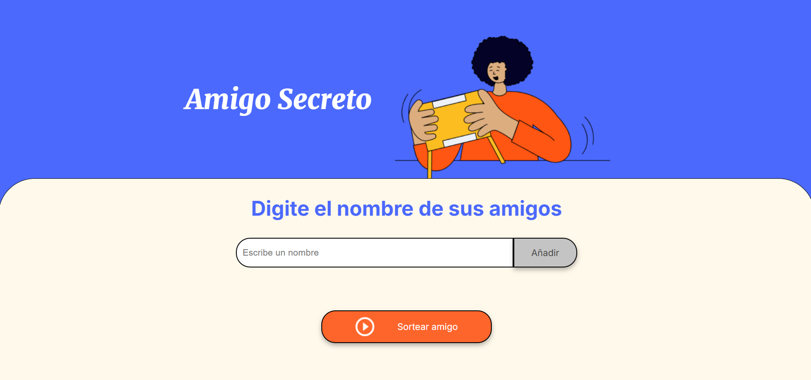
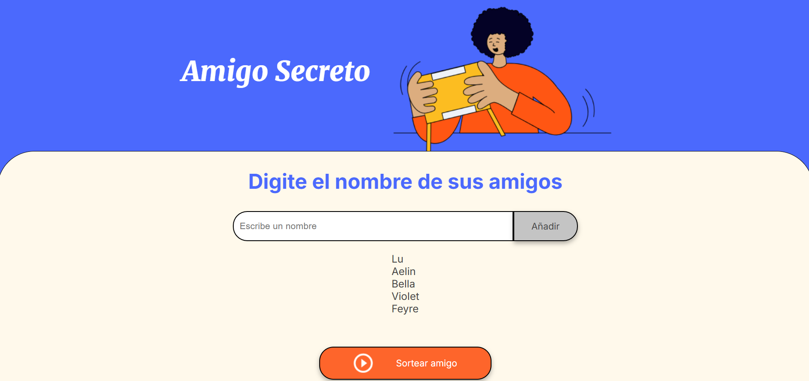
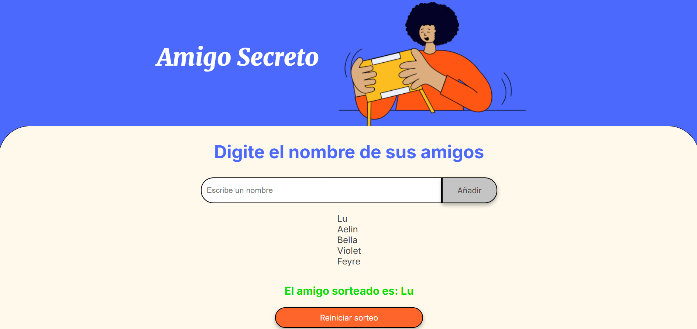

# Amigo Secreto 🎁

**Amigo Secreto** es una aplicación desarrollada como parte del desafío de la formación para principiantes en programación **G8 ONE + ALURA LATAM**.  
El objetivo es permitir a los usuarios ingresar nombres de amigos en una lista y realizar un sorteo aleatorio para determinar quién será el "Amigo Secreto".


## 📌 Índice

1. [🚀 Prueba la aplicación](#-prueba-la-aplicación)  
2. [🖼 Capturas de pantalla](#-capturas-de-pantalla)  
3. [🛠️ Funcionalidades](#️-funcionalidades)  
4. [🛠️ Tecnologías utilizadas](#️-tecnologías-utilizadas)  
5. [📦 Instalación y ejecución](#-instalación-y-ejecución)  
6. [📌 Requisitos](#-requisitos)  
7. [👨‍💻 Autores](#-autores)  
8. [📄 Licencia](#-licencia)  


## 🚀 Prueba la aplicación

Accede a la aplicación sin necesidad de descargar nada:  
👉 **[Ir a la página de Amigo Secreto](https://github.com/wolverin-x/challenge-amigo-secreto)**  


### 🖼 Capturas de pantalla

#### Pantalla principal  
  

#### Después de agregar nombres  
  

#### Resultado del sorteo  
  

#### Reiniciar el sorteo


## 🛠️ Funcionalidades

- **Agregar nombres**: Los usuarios pueden ingresar un nombre en un campo de texto y agregarlo a una lista visible con el botón **"Añadir"**.
- **Validación de entrada**: Si el campo de texto está vacío, se mostrará una alerta solicitando un nombre válido.
- **Visualización de la lista**: Los nombres ingresados aparecen en una lista debajo del campo de entrada.
- **Sorteo aleatorio**: Al hacer clic en **"Sortear Amigo"**, se selecciona aleatoriamente un nombre de la lista y se muestra en pantalla.
- **Reiniciar sorteo**: Al hacer clic en **"Reiniciar Sorteo"**, se limpiara toda la lista, permitiendo iniciar un sorteo nuevo agregando amigos nuevos.


## 🛠️ Tecnologías utilizadas

- **JavaScript** + **HTML5** + **CSS3**


## 📦 Instalación y ejecución

1. Clona este repositorio en tu máquina local:

   ```bash
   git clone https://github.com/wolverine-x/challenge-amigo-secreto.git
   cd challenge-amigo-secreto

2. Abre el archivo index.html en tu navegador.


## 📌 Requisitos
Navegador web actualizado (Google Chrome, Firefox, Edge, etc.).


## 👨‍💻 Autores
- **[Emiliano Davila Gonzalez](https://github.com/wolverin-x)** - Implementación de la lógica en JavaScript.  
- **ALURA LATAM + ONE G8** - Provisión del diseño base en HTML y CSS.
Proyecto desarrollado en el contexto del curso G8 ONE + ALURA LATAM.


## 📄 Licencia
Este proyecto es de código abierto y puede ser utilizado con fines educativos.
